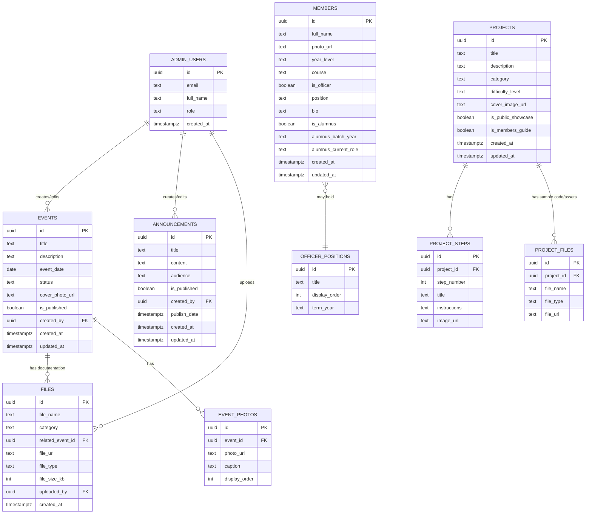

# Database Schema — Cyb Robotics Organization Website

**Database:** PostgreSQL (via Supabase)
**Version:** 1.0
**Date:** August 29, 2026

This document defines the tables, columns, relationships, and access rules for the Cyb Robotics Organization Website database. It maps directly to the data requirements in the SRS (Section 3.3).

---

## 1. Entity-Relationship Overview

---

## 2. Table Definitions

### 2.1 `members`
Stores all current members, officers, and alumni in one table (distinguished by flags), since a person can move between these states over time (e.g., member → officer → alumnus).

| Column | Type | Constraints | Description |
|---|---|---|---|
| `id` | `uuid` | PK, default `gen_random_uuid()` | Unique identifier |
| `full_name` | `text` | NOT NULL | Member's full name |
| `photo_url` | `text` | nullable | Link to profile photo in Supabase Storage |
| `year_level` | `text` | nullable | e.g., "3rd Year" (blank if alumnus) |
| `course` | `text` | nullable | e.g., "BS Computer Science" |
| `is_officer` | `boolean` | default `false` | Whether currently an officer |
| `position` | `text` | nullable | e.g., "Vice President", required if `is_officer = true` |
| `bio` | `text` | nullable | Short bio/description |
| `is_alumnus` | `boolean` | default `false` | Whether this record is an alumnus |
| `alumnus_batch_year` | `text` | nullable | Graduation year, if alumnus |
| `alumnus_current_role` | `text` | nullable | Current job/role, if alumnus |
| `created_at` | `timestamptz` | default `now()` | Record creation timestamp |
| `updated_at` | `timestamptz` | default `now()` | Last updated timestamp |

### 2.2 `officer_positions`
A reference table defining available officer titles and their display order (so the public officer directory renders in a consistent hierarchy, e.g., President before Secretary).

| Column | Type | Constraints | Description |
|---|---|---|---|
| `id` | `uuid` | PK | Unique identifier |
| `title` | `text` | NOT NULL, unique | e.g., "President", "Secretary" |
| `display_order` | `int` | NOT NULL | Sort order for display |
| `term_year` | `text` | nullable | Academic year this position list applies to (e.g., "2026-2027") |

### 2.3 `events`
| Column | Type | Constraints | Description |
|---|---|---|---|
| `id` | `uuid` | PK | Unique identifier |
| `title` | `text` | NOT NULL | Event name |
| `description` | `text` | nullable | Event details |
| `event_date` | `date` | NOT NULL | Date of the event |
| `status` | `text` | NOT NULL, default `'upcoming'` | `'upcoming'` or `'past'` (can be computed from `event_date` too) |
| `cover_photo_url` | `text` | nullable | Main event image |
| `is_published` | `boolean` | default `true` | Controls public visibility |
| `created_by` | `uuid` | FK → `admin_users.id` | Admin who created the record |
| `created_at` / `updated_at` | `timestamptz` | default `now()` | Audit timestamps |

### 2.4 `event_photos`
Supports a photo gallery per event (one-to-many).

| Column | Type | Constraints | Description |
|---|---|---|---|
| `id` | `uuid` | PK | Unique identifier |
| `event_id` | `uuid` | FK → `events.id`, NOT NULL | Parent event |
| `photo_url` | `text` | NOT NULL | Image location |
| `caption` | `text` | nullable | Optional caption |
| `display_order` | `int` | default `0` | Order in gallery |

### 2.5 `projects`
Covers both the public projects showcase and the members-only beginner project guides, distinguished by two boolean flags (a project could appear in both).

| Column | Type | Constraints | Description |
|---|---|---|---|
| `id` | `uuid` | PK | Unique identifier |
| `title` | `text` | NOT NULL | e.g., "Ultrasonic Alarm" |
| `description` | `text` | nullable | Overview/summary |
| `category` | `text` | nullable | e.g., "Arduino", "Sensors" |
| `difficulty_level` | `text` | nullable | e.g., "Beginner", "Intermediate" |
| `cover_image_url` | `text` | nullable | Thumbnail/cover image |
| `is_public_showcase` | `boolean` | default `false` | Shown on public Projects page |
| `is_members_guide` | `boolean` | default `false` | Shown on members page with steps + code |
| `created_at` / `updated_at` | `timestamptz` | default `now()` | Audit timestamps |

### 2.6 `project_steps`
Step-by-step instructions for members-guide projects (one-to-many with `projects`).

| Column | Type | Constraints | Description |
|---|---|---|---|
| `id` | `uuid` | PK | Unique identifier |
| `project_id` | `uuid` | FK → `projects.id`, NOT NULL | Parent project |
| `step_number` | `int` | NOT NULL | Order of the step |
| `title` | `text` | NOT NULL | Step title, e.g., "Wire the sensor" |
| `instructions` | `text` | NOT NULL | Detailed instructions |
| `image_url` | `text` | nullable | Optional diagram/photo for the step |

### 2.7 `project_files`
Sample code and downloadable assets per project.

| Column | Type | Constraints | Description |
|---|---|---|---|
| `id` | `uuid` | PK | Unique identifier |
| `project_id` | `uuid` | FK → `projects.id`, NOT NULL | Parent project |
| `file_name` | `text` | NOT NULL | e.g., "ultrasonic_alarm.ino" |
| `file_type` | `text` | nullable | e.g., "ino", "pdf", "zip" |
| `file_url` | `text` | NOT NULL | Location in Supabase Storage |

### 2.8 `announcements`
| Column | Type | Constraints | Description |
|---|---|---|---|
| `id` | `uuid` | PK | Unique identifier |
| `title` | `text` | NOT NULL | Announcement headline |
| `content` | `text` | NOT NULL | Body text |
| `audience` | `text` | NOT NULL, default `'public'` | `'public'`, `'members'`, or `'both'` |
| `is_published` | `boolean` | default `false` | Draft vs. live |
| `created_by` | `uuid` | FK → `admin_users.id` | Author |
| `publish_date` | `timestamptz` | nullable | When it should appear/appeared |
| `created_at` / `updated_at` | `timestamptz` | default `now()` | Audit timestamps |

### 2.9 `files`
General-purpose files directory for the members page (letters, programmes, branding assets, event documentation) — distinct from `project_files`, which is specific to project guides.

| Column | Type | Constraints | Description |
|---|---|---|---|
| `id` | `uuid` | PK | Unique identifier |
| `file_name` | `text` | NOT NULL | Display name |
| `category` | `text` | NOT NULL | e.g., `'letter'`, `'programme'`, `'branding'`, `'documentation'` |
| `related_event_id` | `uuid` | FK → `events.id`, nullable | Optional link to a specific event |
| `file_url` | `text` | NOT NULL | Location in Supabase Storage |
| `file_type` | `text` | nullable | e.g., "pdf", "docx", "png" |
| `file_size_kb` | `int` | nullable | For display purposes |
| `uploaded_by` | `uuid` | FK → `admin_users.id` | Admin who uploaded it |
| `created_at` | `timestamptz` | default `now()` | Upload timestamp |

### 2.10 `admin_users`
Mirrors relevant Supabase Auth users with role info. Supabase Auth (`auth.users`) handles credentials; this table stores app-specific profile/role data linked by the same `id`.

| Column | Type | Constraints | Description |
|---|---|---|---|
| `id` | `uuid` | PK, FK → `auth.users.id` | Matches Supabase Auth user ID |
| `email` | `text` | NOT NULL | Admin's email (mirrors auth) |
| `full_name` | `text` | nullable | Display name |
| `role` | `text` | default `'admin'` | Reserved for future role tiers (e.g., `'super_admin'`) |
| `created_at` | `timestamptz` | default `now()` | Record creation timestamp |

---

## 3. Relationships Summary

- One **event** can have many **event_photos** and many **files** (via `related_event_id`).
- One **project** can have many **project_steps** and many **project_files**.
- One **admin_user** can create many **events**, **announcements**, and **files** (audit trail via `created_by` / `uploaded_by`).
- **members** is a single flexible table rather than three separate tables (members/officers/alumni), since one person transitions between these states — avoids duplicating a person's record three times.

---

## 4. Row Level Security (RLS) Policy Guidelines

| Table | Public (anon) Read | Public (anon) Write | Authenticated Admin Read | Authenticated Admin Write |
|---|---|---|---|---|
| `members` | ✅ (published fields only) | ❌ | ✅ | ✅ |
| `officer_positions` | ✅ | ❌ | ✅ | ✅ |
| `events` | ✅ (where `is_published = true`) | ❌ | ✅ | ✅ |
| `event_photos` | ✅ | ❌ | ✅ | ✅ |
| `projects` | ✅ (public showcase fields, or all fields if accessed via members page route) | ❌ | ✅ | ✅ |
| `project_steps` / `project_files` | ✅ (members page context only — enforce at app level since the page is unlisted, not auth-gated) | ❌ | ✅ | ✅ |
| `announcements` | ✅ (where `is_published = true` and `audience` matches) | ❌ | ✅ | ✅ |
| `files` | ✅ (members page context only) | ❌ | ✅ | ✅ |
| `admin_users` | ❌ | ❌ | ✅ (self only) | ❌ (managed via Supabase Auth admin, not app UI) |

> **Note:** Since the members page has no login, its "protection" is the unlisted URL, not RLS. RLS should still block anonymous **writes** everywhere — reads for members-page tables can be public at the database level, since the real gate is that the page/route itself isn't discoverable.

---

## 5. Storage Buckets (Supabase Storage)

| Bucket | Purpose | Public/Private |
|---|---|---|
| `avatars` | Member/officer/alumni profile photos | Public read |
| `event-media` | Event cover photos and galleries | Public read |
| `project-media` | Project images and diagrams | Public read |
| `project-code` | Sample code files (.ino, .zip, etc.) | Public read (via members page) |
| `directory-files` | Sample letters, programmes, branding, event docs | Public read (via members page) |

All buckets should disallow public **uploads**; only the server (via authenticated admin actions using the service role key) should write to storage.